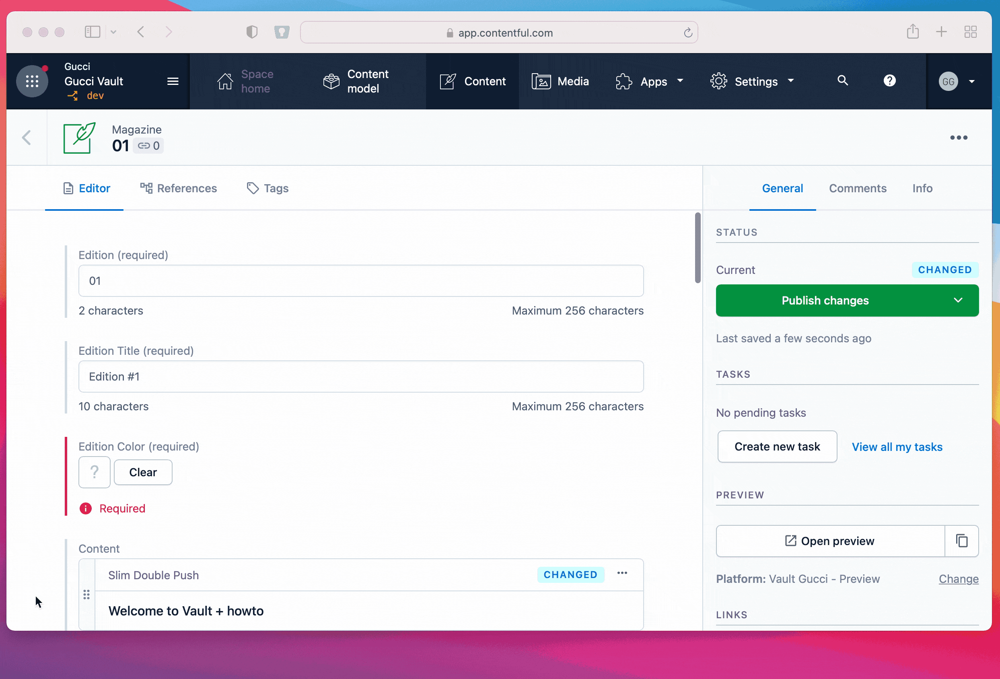

# Color Picker





## Background

This extension has been created with [create-contentful-extension](https://github.com/contentful/create-contentful-extension).

**The extension is hosted by GitHub Pages**.

## Local Setup

Setup your local environment by running

```sh
# install dependencies
npm install

# login to Contentful
npm run login

# configure Contentful space and environment
npm run configure
```

> Be sure to **choose a non-production environment**.
> Choosing `master` or `prod` should be avoided.

Just run `npm start` to deploy and run the extension in development mode.


### Deploy

#### Configuration Changes

When you have done with your configuration changes (*extension.json*), you can easily deploy on the selected space and environment by running

```sh
npm run deploy
```

If you need to deploy the extension to a different environment you can use the option `--environment-id`.

```sh
npm run deploy -- --environment-id dev
```

#### Code Changes

This extension is hosted by [GitHub Pages](https://pages.github.com/). You just need to push to the `main` branch to make it live :rocket:


## Useful Links

- https://github.com/contentful/create-contentful-extension
- https://www.contentful.com/developers/docs/extensibility/app-and-ui-extension-parameters/
